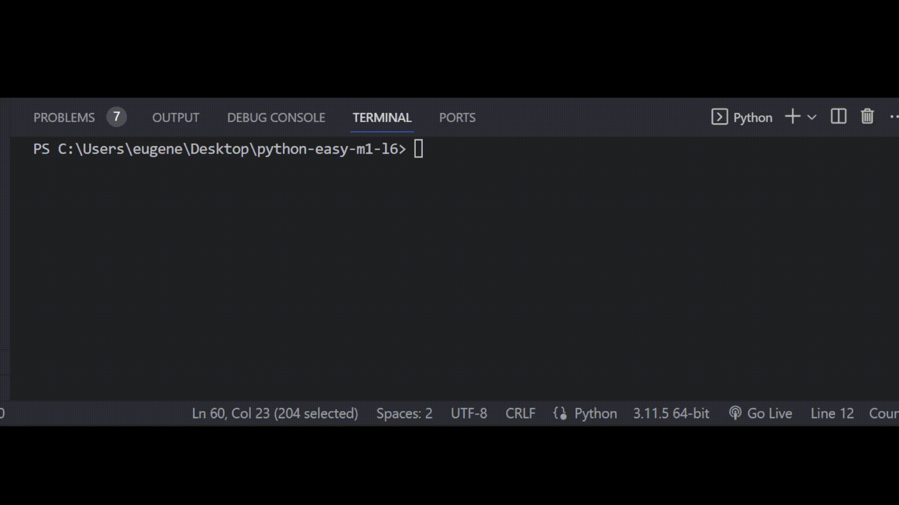

# Задача 5

Реши задачу

Друг Бо продолжает разработку игры, на этот раз он писал код который, отвечал за открытие и закрытие дверей в игре.

Логика этого кода звучит так:

Если дверь "Открыта": Дверь закрывается и становится "Закрытой"

Иначе если дверь "Закрыта": Дверь открывается и становится "Открытой"

Если статус двери равен "ЛОВУШКА", то выводим сообщение о том что за дверью может быть опасно.

# Резльутат

