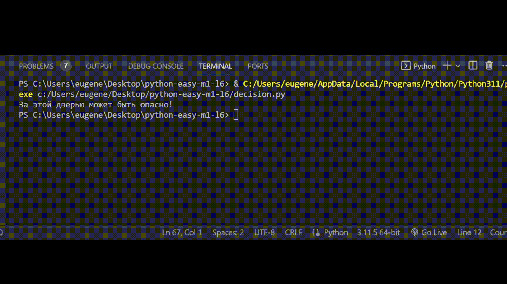

# Задача 6

Реши задачу

Бо посетил магазин «Долголетие», этот магазин запустил акцию «1=3». Покупатель может приобрести любые три товара, заплатить за самый дорогой из них, а остальные — получить в подарок.

Напиши программу, определяющую самую высокую цену из трёх и печатающую сумму к оплате.

# Резльутат

