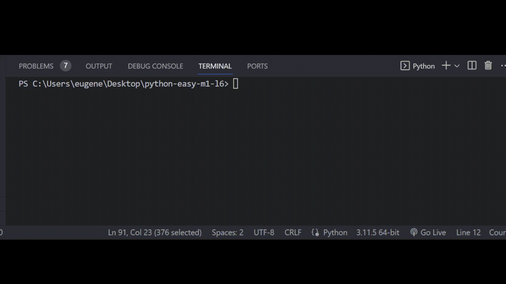

# **Задача 7**

**Перепиши код программы**

Бо стал участником комиссии в одном конкурсе организованный учениками академии. Ему нужно написать программу для фильтрации кандидатов которые могут участвовать в конкурсе.

Упрости процесс чтения программы путем добавления вложенности.

Пример:

if param1 == param2 and param3 == param4:

```
print(something)
```

↓

if param1 == param2:

```
if param3 == param4:

    print(something)
```

# Резльутат


