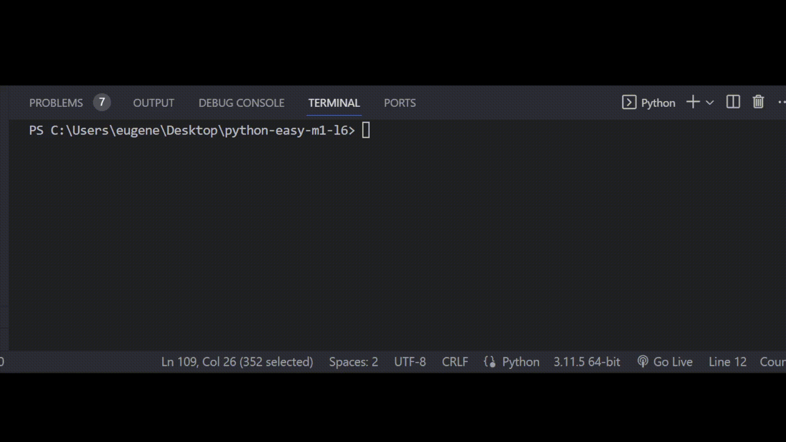

# Задача 8

Исправь ошибки в коде

Бо очень любит ходить пешком, это подало ему идею для создания приложения "Шагомер". Приложение считает пройденные шаги в сутки и выводит Бо сообщение в зависимости от количества шагов.

Дневная норма шагов для Бо равна 8000.

Он написал программу, однако в ней есть ошибки, исправь их.

# Резльутат

