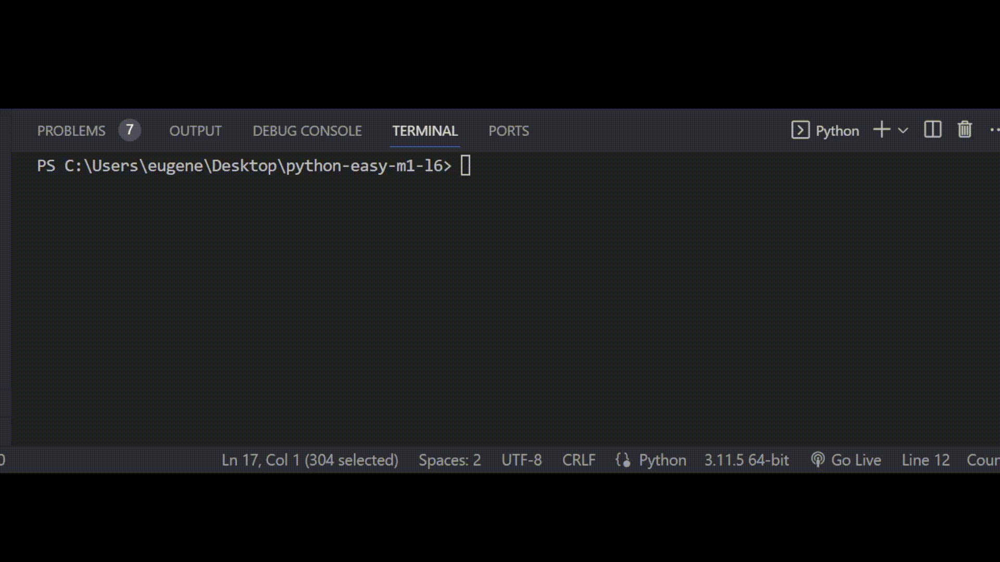

# Задача 1

Исправь ошибки в коде

Бо решил заняться бесплатным репетиторством, чтобы получить новый полезный опыт.

Один из учеников Бо писал код с проверкой введенных данных пользователей, равны они определенным значениям или нет.

Ученик Бо допустил ошибку при написании кода, найди ее и исправь.

# Резльутат

