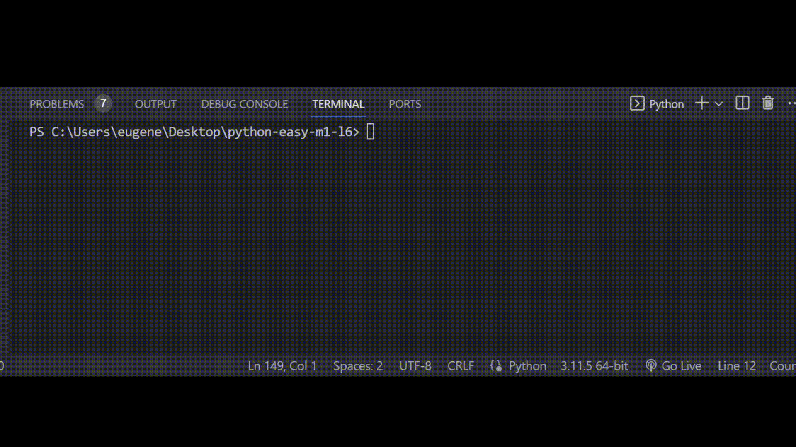

# Задача 7

**Реши задачу**

Бо решил сменить оператора сотовой связи и купил новую симку, одной из особенностей этого оператора было то, что Бо мог сам придумать номер телефона. Однако программа на сайте оператора была неисправна, поэтому он решил написать свою.

По правилам, каждый телефонный номер перед регистрацией должен пройти 2 степени проверки.

Напиши программу, которая будет:

* 1) Принимать на вход телефонный номер который хочет зарегистрировать пользователь.
* 2) Выполняет проверку телефонного номера на верный формат:

  ```
    - Длина телефонного номера больше или равна 11 цифрам И телефонный номер состоит только из цифр (можешь использовать для этого метод isnumeric()) 
    - Такого телефонного номера не должно быть в списке с уже зарегистрированными номерами (Для этого можно использовать not + in) И телефонный номер должен иметь "8677" в начале.
  ```
* * Если телефонный номер прошел все степени проверки, то программа выводит "Телефонный номер успешно зарегистрирован!"
  * Иначе, программа выводит "Телефонный номер записан с ошибкой!"

# Резльутат


