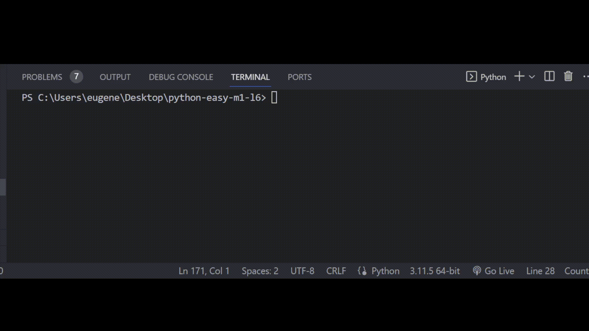

# Задача 8

Дополни код программы

Бо недавно прошел тест на внимательность на одном сайте, сайт по окончанию теста должен был проверить результат Бо, однако сайт не имел такой функции.

Помоги Бо написать эту функцию по следующим инструкциям:

1) Программа считает суммарное число очков после прохождения теста (перемененные с результатами уже даны).
2) Программа принимает на вход пол пользователя {М // Ж}.
3) Программа принимает почту пользователя для дополнительной отправки результатов на нее.
4) Проверка результатов:

- Если пол равен М:

  - Если суммарный результат больше или равен 17, то программа выводит "Ты очень невнимательный!"
  - Иначе если суммарный результат больше или равно 13, но меньше 17, то программа выводит "Ты достаточно невнимателен и тебе сложно заметить мелкие детали."
  - Иначе если суммарный результат больше или равно 5, но меньше 13, то программа выводит "У тебя все хорошо!"
  - Иначе если суммарный результат больше или равно 0, но меньше 5, то программа выводит "У тебя все просто супер!"
- Если пол равен Ж:

  - Если суммарный результат больше или равно 17, то программа выводит "Ты очень невнимательная!"
  - Иначе если суммарный результат больше или равно 13, но меньше 17, то программа выводит "Ты достаточно невнимательна и тебе сложно заметить мелкие детали."
  - Иначе если суммарный результат больше или равно 5, но меньше 13, то программа выводит "У тебя все хорошо!"
  - Иначе если суммарный результат больше или равно 0, но меньше 5, то программа выводит "У тебя все просто супер!"

# Результат

