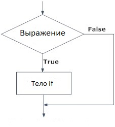
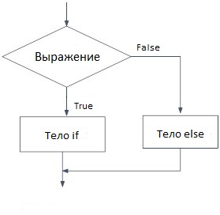
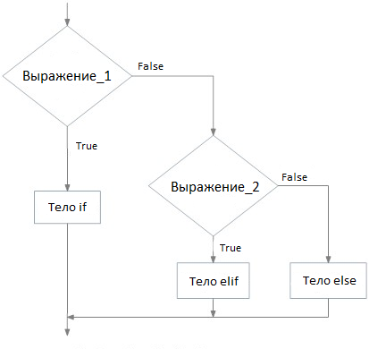

# Условный оператор if...else в Python

###### Иногда нужно, чтобы кусок кода выполнялся только при выполнении определенного условия. Для этого нужно уметь оценивать условия. Чтобы на основе оценки определенного выражения можно было принять решение, выполнять определенный код или нет, в Python существует условный оператор `if...elif...else`.


**Еще 1 статья про условный оператор [есть в предыдущем уроке](https://github.com/Codynodycom/python-easy-m1-l5/blob/main/theory/02-coditions.md).**


## Конструкция if

#### Синтаксис конструкции

```python
if выражение:
    оператор(ы)
```

Программа, код которой вы видите выше, оценивает значение `выражение`, которое может быть равно `True` или `False`. Программа выполнит оператор(ы), только если `выражение` = `True`. Если `выражение` = `False`, этот кусок кода не будет выполняться.

В Python тело конструкции if обозначается отступами. Тело начинается с первой строки с отступом и заканчивается первой строкой без отступа.

Работая с условной конструкцией, важно знать, что Python интерпретирует ненулевые значения как `True`. `None` и `0` интерпретируются как `False`.

#### Блок-схема конструкции



#### Пример использования конструкции

```python
# Если число положительно, мы выведем на экран соответствующее сообщение.

num = 3
if num > 0:
    print(num, "— положительное число.")
print("Это сообщение напечатается в любом случае.")

num = -1
if num > 0:
    print(num, "— положительное число.")
print("Это сообщение тоже напечатается в любом случае.")
```

**Вывод: **

```python
3 — положительное число. 
Это сообщение выведется в любом случае.
Это сообщение тоже выведется в любом случае. 
```

В примере выше `num > 0` — выражение, которое проверяется на истинность. Только если это выражение окажется истинным, т.е. `True`, выполнится тело оператора `if`.

При `num` = 3 выражение `num > 0` истинно, поэтому Python выполнит оператор, находящийся в теле if. Вот почему на экран выводится сообщение «3 — положительное число».

При `num` = -1 выражение `num > 0` ложно, поэтому Python проигнорирует оператор, находящийся в теле if.

А вот функции вывода на экран `print("Это сообщение выведется в любом случае.")` и `print("Это сообщение тоже выведется в любом случае.")` находятся вне блока if, поэтому выполняются при любых значениях `num`.

## Конструкция if...else

#### Синтаксис конструкции

```python
if выражение:
    Тело if
else:
    Тело else
```

Оператор `if...else` оценивает `выражение` и выполняет `тело if` только в том случае, если `выражение` (условие) истинно, то есть равно `True`.

Если `выражение` равно `False`, выполняется `тело else`. Для разделения этих блоков используются отступы.

#### Блок-схема конструкции



#### Пример использования конструкции

```python
# Программа проверяет, является ли число положительным 
# или отрицательным и выводит соответствующее сообщение.  

num = 3

# Также попробуйте следующие два варианта. 
# num = -5
# num = 0

if num >= 0:
    print("Число больше либо равно 0")
else:
    print("Отрицательное число")
```

**Вывод: **

```
Число больше либо равно 0
```

В приведенном выше примере при `num` = 3 `выражение` истинно, поэтому выполняется тело `if`, а тело `else` игнорируется.

При `num` =  -5 `выражение` ложно, поэтому выполняется тело `else`. В этом слуае  игнорируется тело `if`.

При `num` = 0 `выражение` истинно, поэтому выполняет тело равно `if`, а тело `else` игнорируется.

## Конструкция if...elif...else

#### Синтаксис конструкции

```python
if выражение_1:
    Тело if
elif выражение_2:
    Тело elif
else: 
    Тело else
```

`elif` — это сокращение от `else if`. Этот оператор позволяет нам проверять сразу несколько выражений.

Если условие для `if` = `False`, Python оценивает условие блока `elif` и так далее. Если все условия = `False`, выполняется тело `else`.

Для одного `if` может быть только один `else`. Но внутри конструкции `if...else` может быть сколько угодно блоков `elif`.

#### Блок-схема конструкции



#### Пример использования конструкции

```python
# В этой программе мы проверяем, 
# является ли число положительным,
# отрицательным или нулем и 
# выводим соответствующее выражение.

num = 3.4

# Также попробуйте такие варианты:
# num = 0
# num = -4.5

if num > 0:
    print("Положительное число")
elif num == 0:
    print("Ноль")
else:
    print("Отрицательное число")
```

Если переменная `num` содержит положительное значение, Python выведет на экран сообщение «Положительное число».

Если `num` равно 0, напечатается сообщение «Ноль».

Если `num` содержит отрицательное значение, Python выведет на экран сообщение «Отрицательное число».

## Вложенные конструкции

Любое количество блоков `if…elif…else` можно разместить внутри другого оператора `if…elif…else`. Отступы — единственный способ отделять разные уровни вложенности. Это делает код сложнее для понимания, поэтому загроможденной вложенности желательно избегать.

```python
# В этой программе мы вводим число,
# проверяем, является ли число положительным,
# отрицательным или нулем, и выводим
# соответствующее сообщение. 
# На этот раз мы используем вложенную конструкцию. 

num = float(input("Введите число: "))
if num >= 0:
    if num == 0:
        print("Ноль")
    else:
        print("Положительное число")
else:
    print("Отрицательное число")
```

**Вывод 1:**

```
Введите число: 5
Положительное число
```

**Вывод 2:**

```
Введите число: -1
Отрицательное число
```

**Вывод 3:**

```
Введите число: 0
Ноль
```
